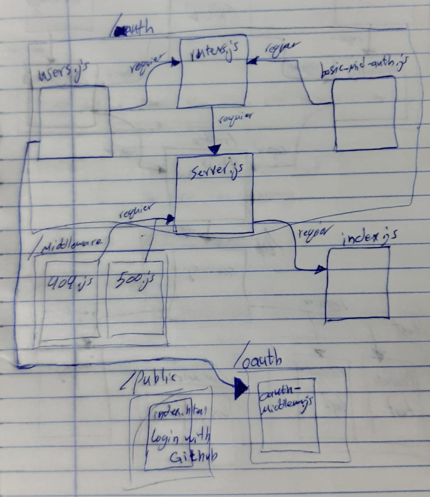

# OAuth

# LAB - Class 11

### Author: Ahmad Sawalqeh

### Links and Resources

- [submission PR](https://github.com/Ahmad-Sawalqeh/Authentication/pull/2)
- [ci/cd]() (GitHub Actions)

### Setup
run `npm i`
install the needed Dependencies `JEST, ESLINT, CORS, DOTENV, MORGAN, MONGOOSE, EXPRESS`. 
also you need `base-64`, `bcryptjs` and `jsonwwebtoken` for authentication/authorization sign-in by github account.

`.env` requirements (where applicable)

* `PORT` - 3000
* `MONGODB_URI` - 'mongodb://localhost:27017/class12'
* `SECRET` - `MYOWNSECRET`
* `CLIENT_ID` - 6adabe1798d74605bcd7
* `CLIENT_SECRET` - 9cf2052a1defe82ad3b91f1c7e852343a2b91dfb
* `API_SERVER` - http://localhost:3000/oauth

#### How to initialize/run your application (where applicable)
run `npm test` to check all test.

#### Tests

- How do you run tests? 
  run `npm test`

  # UML

  