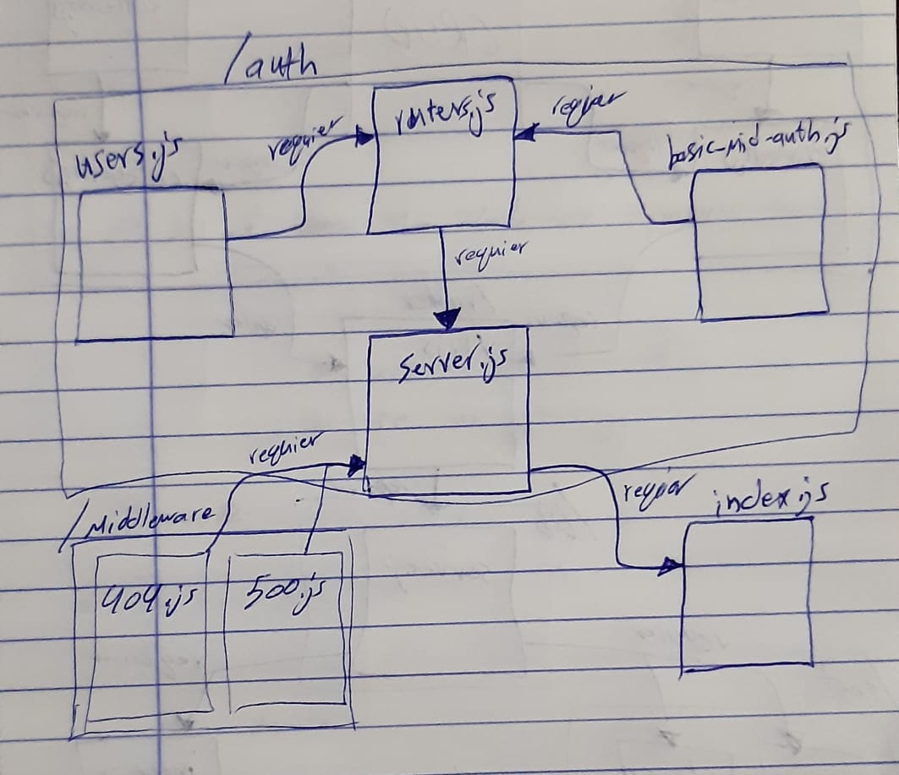

# Authentication

# LAB - Class 11

### Author: Ahmad Sawalqeh

### Links and Resources

- [submission PR](https://github.com/Ahmad-Sawalqeh/Authentication/pull/1)
- [ci/cd]() (GitHub Actions)

### Setup
run `npm i`
install the needed Dependencies `JEST, ESLINT, CORS, DOTENV, MORGAN, MONGOOSE, EXPRESS`. 
also you need `base-64`, `bcryptjs` and `jsonwwebtoken` for authentication sign-in/sign-up.

`.env` requirements (where applicable)

* `PORT` - 3000
* `MONGODB_URI` - 'mongodb://localhost:27017/class11'

#### How to initialize/run your application (where applicable)
run `npm test` to check all test.

#### Tests

- How do you run tests? 
  run `npm test`

  # UML

  